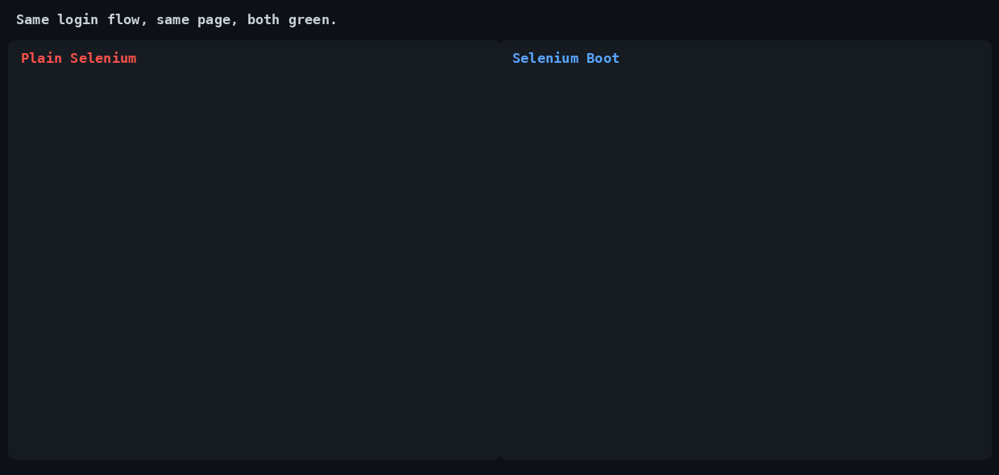
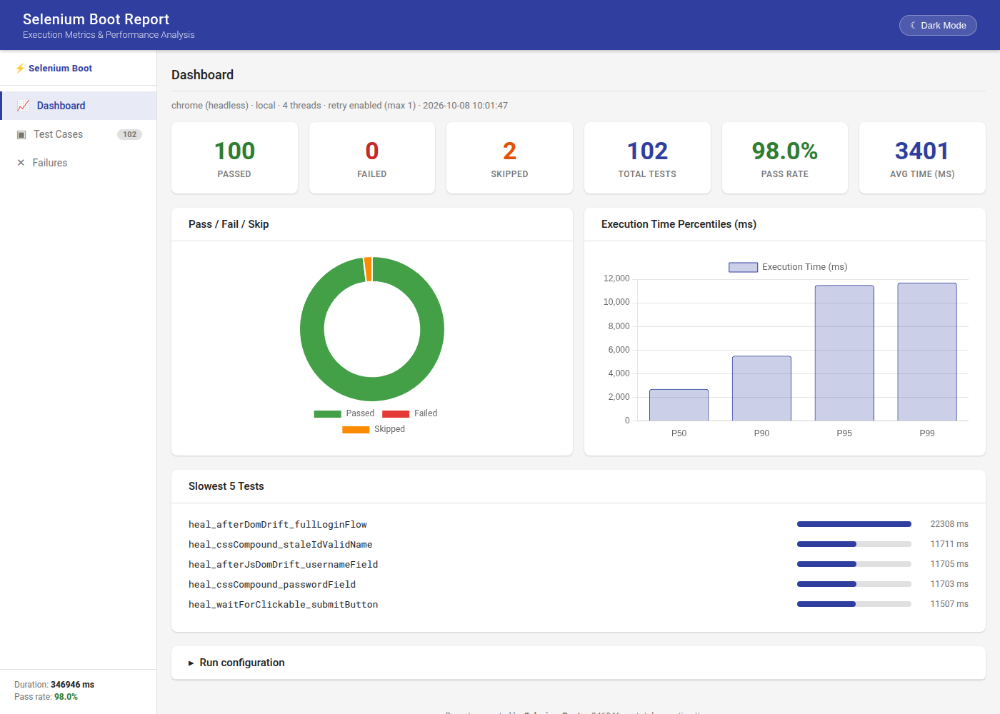

# Selenium Boot

**The Spring Boot of Selenium — Playwright-inspired APIs, zero setup, and enterprise features, without hiding Selenium**

[](https://central.sonatype.com/artifact/io.github.seleniumboot/selenium-boot)
[](LICENSE)
[](CONTRIBUTING.md)
[](https://github.com/seleniumboot/selenium-boot/issues?q=is%3Aissue+is%3Aopen+label%3A%22good+first+issue%22)

**[Documentation](https://docs.seleniumboot.com) · [Starter Template](https://github.com/seleniumboot/selenium-boot-starter) · [Sample Project](https://github.com/seleniumboot/selenium-boot-test) · [Changelog](#project-status)**



*The same login flow against a real page, written both ways. Both tests pass.*

---

## Quickstart — a green test in 60 seconds

Three files. Copy them as-is and `mvn test` goes green against a real Chrome.

**Prerequisites:** Java 17+, Maven 3.8+, Chrome installed. No WebDriver binaries — Selenium Manager fetches them.

**1. `pom.xml`**

```xml
<properties>
    <maven.compiler.release>17</maven.compiler.release>
</properties>

<dependencies>
    <dependency>
        <groupId>io.github.seleniumboot</groupId>
        <artifactId>selenium-boot</artifactId>
        <version>3.7.0</version>
    </dependency>
</dependencies>

<build>
    <plugins>
        <plugin>
            <groupId>org.apache.maven.plugins</groupId>
            <artifactId>maven-compiler-plugin</artifactId>
            <version>3.11.0</version>
        </plugin>
        <plugin>
            <groupId>org.apache.maven.plugins</groupId>
            <artifactId>maven-surefire-plugin</artifactId>
            <version>3.2.5</version>
        </plugin>
    </plugins>
</build>
```

**2. `selenium-boot.yml`** — project root, next to `pom.xml`. The test below calls `open()`, which needs `baseUrl`. The browser, mode and timeouts shown are the built-in defaults, listed for reference.

```yaml
execution:
  mode: local
  baseUrl: https://example.com

browser:
  name: chrome

timeouts:
  explicit: 10
  pageLoad: 30
```

**3. `src/test/java/SmokeTest.java`**

```java
import com.seleniumboot.locator.Role;
import com.seleniumboot.test.BaseTest;
import org.testng.annotations.Test;

public class SmokeTest extends BaseTest {

    @Test
    public void opensThePage() {
        open();
        assertThat(getByRole(Role.HEADING, "Example Domain")).isVisible();
        assertThat(getByRole(Role.LINK)).isVisible();
    }
}
```

Then:

```bash
mvn test
```

No driver setup, no teardown, no waits, no `WebDriver` to manage — `BaseTest` owns the lifecycle. The HTML report lands at `target/selenium-boot-report.html`.



*The report from the [sample project](https://github.com/seleniumboot/selenium-boot-test)'s suite (102 tests, parallel).*

Note what the test *doesn't* contain: no CSS selector, no XPath, no `WebDriverWait`. `getByRole`
finds elements the way a screen reader does, and `assertThat(...).isVisible()` retries until the
timeout instead of failing on the first miss. Both are available on every test and page object.

### The same test, written the usual way

Illustrative — a sign-in flow, raw Selenium on the left of the line, Selenium Boot below it.

```java
// Plain Selenium + TestNG
WebDriver driver = new ChromeDriver();
driver.get("https://app.example.com");
WebDriverWait wait = new WebDriverWait(driver, Duration.ofSeconds(10));

wait.until(ExpectedConditions.visibilityOfElementLocated(By.cssSelector("#email")))
    .sendKeys("ada@example.com");
driver.findElement(By.cssSelector("#password")).sendKeys("hunter2");
driver.findElement(By.cssSelector("button.btn-primary[type='submit']")).click();
wait.until(ExpectedConditions.visibilityOfElementLocated(
    By.xpath("//*[contains(text(),'Welcome back')]")));

driver.quit();
```

```java
// Selenium Boot — same flow
open();
getByLabel("Email").type("ada@example.com");
getByLabel("Password").type("hunter2");
getByRole(Role.BUTTON, "Sign in").click();
assertThat(getByText("Welcome back")).isVisible();
```

The second version has no driver lifecycle, no explicit waits, and nothing coupled to the
markup — rename a CSS class or reorder the DOM and it still passes. The raw `WebDriver` is
still there via `getDriver()` whenever you need it.

Next: [page objects and tests](#page-objects-and-tests), [configuration](#configuration), and the [documentation](https://docs.seleniumboot.com).

---

## Overview

Selenium Boot is an opinionated framework for Java Selenium, inspired by Spring Boot. Add one dependency, extend `BaseTest` / `BasePage`, and the driver lifecycle, waits, retries, reporting and CI wiring are already decided.

- **Convention over configuration.** Browser, mode and timeouts have built-in defaults; `selenium-boot.yml` only says what you want to change.
- **Never hides Selenium.** The raw `WebDriver` / `By` / `WebElement` is always one call away via `getDriver()`.
- **Extensible, not required.** Custom drivers, report adapters and hooks plug in through SPI. Most users never touch it.

Already on Selenium? You keep your stack, TestNG, team skills and Grid, and gain accessibility-first locators, auto-waiting and web-first assertions. Why it exists and how it compares: [Why Selenium Boot](https://docs.seleniumboot.com/why/why-selenium-boot).

---

## What You Get Out of the Box

Outcomes first — the API that delivers each one is named so you can find it in the docs.

- **No driver setup, teardown or `Thread.sleep()`** — thread-safe WebDriver lifecycle per test and an auto-waiting `WaitEngine`
- **Tests less coupled to markup** — accessibility-first locators (`getByRole`, `getByText`, `getByLabel`, `getByPlaceholder`, `getByTestId`, `getByAltText`, `getByTitle`) plus a `SmartLocator` fallback
- **Transient failures don't fail the build** — automatic retry via `@Retryable`; flaky tests are still reported as retried
- **Parallel runs that are safe** — thread-isolated drivers, `parallel` in one YAML line
- **See exactly why a test failed** — screenshot on failure, `StepLogger` named steps, and an HTML report with pass-rate gauge, slowest tests and step timeline
- **Write pages, not plumbing** — `BasePage` with wait-backed `click`, `type`, `getText`, iFrame helpers and file upload; `@PreCondition` logs in once and reuses the session
- **UI and API in the same suite** — `BaseApiTest` + fluent `ApiClient` with auth, schema validation and JSONPath
- **CI-aware defaults** — detects GitHub Actions, Jenkins, CircleCI and others; forces headless, emits JUnit XML

Also built in: accessibility checks (axe-core bundled), download testing, JavaScript console-error capture, environment profiles, and SPI plugins for custom drivers, report adapters and hooks.

---

## Page Objects and Tests

Extend `BasePage` for the same semantic locators plus wait-backed helpers (`click`, `type`, `getText`, `isDisplayed`, `withinFrame`, `upload`):

```java
public class LoginPage extends BasePage {

    public LoginPage(WebDriver driver) {
        super(driver);
    }

    public void login(String username, String password) {
        getByLabel("Username").type(username);
        getByLabel("Password").type(password);
        getByRole(Role.BUTTON, "Log in").click();
    }
}
```

Prefer semantic locators. When an element has no accessible name, fall back to `By` — `type(By.id("username"), username)` — or to the raw `WebDriver`.

Extend `BaseTest` — that's all the setup a test needs:

```java
public class LoginTest extends BaseTest {

    @Test
    public void loginWithValidCredentials() {
        StepLogger.step("Open login page");
        open();

        StepLogger.step("Enter credentials and submit", true);
        new LoginPage(getDriver()).login("admin", "password123");

        assertTrue(getDriver().getCurrentUrl().contains("/dashboard"));
    }
}
```

- Never instantiate or quit `WebDriver` yourself — the framework manages it.
- `getDriver()` returns the current thread's driver.
- `open()` navigates to `baseUrl`; `open("/path")` to a sub-path.

---

## Configuration

`selenium-boot.yml` lives at the project root, next to `pom.xml`. It is optional: omit the file, or any key, and the built-in default applies. The one exception is `execution.baseUrl`, which has no default and is needed by `open()`. Values that are present but invalid (an unknown `execution.mode`, a negative timeout) fail at startup.

```yaml
execution:
  mode: local           # local | remote
  baseUrl: https://example.com
  parallel: methods     # none | methods | classes
  threadCount: 4

browser:
  name: chrome          # chrome | firefox
  headless: false

retry:
  enabled: true
  maxAttempts: 2

timeouts:
  explicit: 10          # seconds — used by WaitEngine
  pageLoad: 30          # seconds
```

Run on a Selenium Grid by switching mode — no code changes:

```yaml
execution:
  mode: remote
  gridUrl: http://localhost:4444/wd/hub
```

Environment profiles (`-Dselenium.boot.profile=staging`), `ci:` quality gates and every other key are in the [configuration reference](https://docs.seleniumboot.com/configuration); the `api:` keys are in [API testing](https://docs.seleniumboot.com/guides/api-testing).

---

## Learn More

| | |
|---|---|
| **Core** | [BaseTest](https://docs.seleniumboot.com/guides/base-test) · [BasePage](https://docs.seleniumboot.com/guides/base-page) · [Locators](https://docs.seleniumboot.com/guides/semantic-locators) · [Waits](https://docs.seleniumboot.com/guides/wait-engine) · [Retry](https://docs.seleniumboot.com/guides/retry) · [Parallel](https://docs.seleniumboot.com/guides/parallel) · [@PreCondition](https://docs.seleniumboot.com/guides/precondition) |
| **API testing** | [API testing](https://docs.seleniumboot.com/guides/api-testing) · [Authentication](https://docs.seleniumboot.com/guides/api-auth) · [Scenario & suite context](https://docs.seleniumboot.com/guides/scenario-context) |
| **Reporting** | [HTML report](https://docs.seleniumboot.com/reporting/html-report) · [JUnit XML](https://docs.seleniumboot.com/reporting/junit-xml) |
| **CI/CD** | [GitHub Actions](https://docs.seleniumboot.com/ci/github-actions) · [Jenkins](https://docs.seleniumboot.com/ci/jenkins) · [Quality gates](https://docs.seleniumboot.com/ci/quality-gates) |
| **Extending** | [Custom drivers](https://docs.seleniumboot.com/extensibility/custom-drivers) · [Report adapters](https://docs.seleniumboot.com/extensibility/report-adapters) · [Hooks](https://docs.seleniumboot.com/extensibility/hooks) · [Plugins](https://docs.seleniumboot.com/extensibility/plugins) |
| **Migrating** | [From Selenium + TestNG](https://docs.seleniumboot.com/migration/from-selenium-testng) · [Coming from Playwright](https://docs.seleniumboot.com/migration/coming-from-playwright) |
| **Examples** | [Sample project](https://github.com/seleniumboot/selenium-boot-test) · [Starter template](https://github.com/seleniumboot/selenium-boot-starter) |

---

## Related Tools

### Already have a Selenium Java project?

[`selenium-boot-migrator`](https://github.com/seleniumboot/selenium-boot-migrator) analyzes it first and
changes nothing: what maps cleanly, what needs manual work. Maven and Gradle (including version catalogs).

```bash
java -jar selenium-boot-migrator.jar analyze path/to/your-project
```

Grab the jar from the [latest release](https://github.com/seleniumboot/selenium-boot-migrator/releases/latest). Requires Java 17+.

> **Let an AI assistant drive a real browser and write the tests**
> **seleniumboot-mcp** is a standalone MCP server for Claude / GitHub Copilot: it controls Chrome, records your session, and generates ready-to-run test code (Java TestNG / JUnit 5 / Gherkin, Python, C#, Playwright) — Selenium Boot-native when the dependency is present. Its `migrate` tool runs the analysis above for you.
> ```
> pip install seleniumboot-mcp
> ```
> [PyPI](https://pypi.org/project/seleniumboot-mcp/) · [GitHub](https://github.com/seleniumboot/selenium-mcp) · 43 tools by default (77 total) · self-healing locators

---

## Project Status

**Current release: v3.7.0** — live-triage debug mode (`debug.slowMoMs` / `debug.highlight`), `withNewWindow` / `withNewTab`, `Locator.dragTo`, and `browser.version` pinning.

See the full version history in **[CHANGELOG.md](CHANGELOG.md)**.

---

## License

Licensed under the [Apache License, Version 2.0](LICENSE).

---

## Contributing

Contributions are warmly welcome — Selenium Boot is opinionated, and contributions that align with its philosophy (zero boilerplate, convention over configuration, never hide Selenium) help the whole community.

**New here?** The best place to start:

- 🙌 [**Good first issues**](https://github.com/seleniumboot/selenium-boot/issues?q=is%3Aissue+is%3Aopen+label%3A%22good+first+issue%22) — scoped, self-contained tasks
- 🤝 [**Help wanted**](https://github.com/seleniumboot/selenium-boot/issues?q=is%3Aissue+is%3Aopen+label%3A%22help+wanted%22) — larger pieces we'd love a hand with
- 🗺️ [**Roadmap**](ROADMAP.md) — where the project is heading and where help fits
- 💬 [**Discussions**](https://github.com/seleniumboot/selenium-boot/discussions) — questions and feature ideas

Then read [CONTRIBUTING.md](CONTRIBUTING.md) for dev setup, the PR checklist, and the backward-compatibility policy. Bug reports and feature requests both have [issue templates](https://github.com/seleniumboot/selenium-boot/issues/new/choose) to guide you.

---

## Disclaimer

Selenium Boot is an independent open-source project and is not affiliated with Selenium or the Spring Framework.
